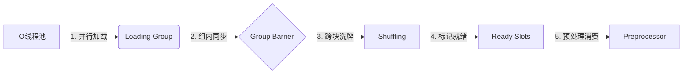

# 【十四、专家方案】

## 【方案B】

**（专家：OP）**

### 自研深度学习框架数据集读取模块设计方案

#### 一、设计哲学与核心洞察

在深入研究了你们的需求后，我提出一个**"流水线解耦+状态机驱动"**的设计方案。核心洞察如下：

##### 1.1 关键瓶颈分析

从你们的实验数据可以看出：

- **磁盘带宽不是瓶颈**：16线程Native API可达17.1 GB/s
- **真正的瓶颈是协调开销**：多线程之间的同步、等待、状态查询

##### 1.2 设计原则

1. **"生产者专注生产，消费者专注消费"**：DataLoader只管读磁盘，Preprocessor只管处理，两者通过精心设计的缓冲区解耦
2. **"状态可查询，无需等待"**：消费者可以即时知道哪些数据已就绪，而不是盲目等待
3. **"粒度适配场景"**：全量模式按样本粒度，部分模式按BLOCK粒度

---

#### 二、架构设计

##### 2.1 整体架构

```
┌─────────────────────────────────────────────────────────────────────┐
│                        DataLoaderBase (抽象基类)                     │
│  - 定义统一接口                                                       │
│  - 管理Epoch生命周期                                                  │
│  - 提供样本获取API                                                    │
└─────────────────────────────────────────────────────────────────────┘
                    ▲                           ▲
                    │                           │
        ┌───────────┴───────────┐   ┌──────────┴───────────┐
        │   RawDataLoader       │   │   DtsDataLoader      │
        │  (原始目录结构)        │   │  (.dts高速加载)       │
        │  - ImageNet目录扫描    │   │  - BLOCK级IO         │
        │  - 按需读取单文件      │   │  - 循环队列管理       │
        └───────────────────────┘   └──────────────────────┘
                                              │
                                              │ 使用
                                              ▼
                                    ┌─────────────────────┐
                                    │  BlockArena         │
                                    │  (统一内存管理)      │
                                    │  - 全量/部分模式    │
                                    │  - 状态位图管理     │
                                    └─────────────────────┘
```

##### 2.2 核心创新：状态位图驱动

不同于前面专家使用原子变量管理单个BLOCK状态，我采用**位图（Bitmap）**统一管理所有BLOCK状态，带来以下优势：

1. **缓存友好**：一个64位整数可表示64个BLOCK的状态
2. **批量查询**：通过位运算快速找到所有就绪BLOCK
3. **零锁竞争**：使用原子CAS操作位图

```cpp
// 状态位图设计
// 每个BLOCK用2位表示状态：00=空闲, 01=加载中, 10=就绪, 11=保留
// 一个uint64可管理32个BLOCK
class BlockStateBitmap {
private:
    std::vector<std::atomic<uint64_t>> bitmap_;
    size_t num_blocks_;
    
public:
    static constexpr uint64_t STATE_FREE    = 0b00;
    static constexpr uint64_t STATE_LOADING = 0b01;
    static constexpr uint64_t STATE_READY   = 0b10;
    
    // 尝试将BLOCK从FREE转为LOADING（CAS操作）
    bool try_acquire_for_write(uint32_t block_idx) {
        size_t word_idx = block_idx / 32;
        size_t bit_offset = (block_idx % 32) * 2;
        
        uint64_t old_val = bitmap_[word_idx].load(std::memory_order_relaxed);
        while (true) {
            uint64_t state = (old_val >> bit_offset) & 0b11;
            if (state != STATE_FREE) return false;
            
            uint64_t new_val = (old_val & ~(0b11ULL << bit_offset)) 
                             | (STATE_LOADING << bit_offset);
            
            if (bitmap_[word_idx].compare_exchange_weak(
                    old_val, new_val,
                    std::memory_order_acq_rel,
                    std::memory_order_relaxed)) {
                return true;
            }
        }
    }
    
    // 标记BLOCK为就绪
    void mark_ready(uint32_t block_idx) {
        size_t word_idx = block_idx / 32;
        size_t bit_offset = (block_idx % 32) * 2;
        
        uint64_t old_val = bitmap_[word_idx].load(std::memory_order_relaxed);
        uint64_t new_val;
        do {
            new_val = (old_val & ~(0b11ULL << bit_offset)) 
                    | (STATE_READY << bit_offset);
        } while (!bitmap_[word_idx].compare_exchange_weak(
                    old_val, new_val,
                    std::memory_order_release,
                    std::memory_order_relaxed));
    }
    
    // 批量查询就绪BLOCK（返回最多64个）
    uint64_t get_ready_mask(size_t word_idx) {
        uint64_t raw = bitmap_[word_idx].load(std::memory_order_acquire);
        uint64_t mask = 0;
        for (int i = 0; i < 32; ++i) {
            if (((raw >> (i * 2)) & 0b11) == STATE_READY) {
                mask |= (1ULL << i);
            }
        }
        return mask;
    }
};
```

---

#### 三、内存布局设计

##### 3.1 全量加载模式

```
┌─────────────────────────────────────────────────────────────────────┐
│                     主内存区（DataArena）                            │
│  特点：一次性分配，永不释放，零碎片                                    │
├─────────────────────────────────────────────────────────────────────┤
│                                                                     │
│  ┌─────────┬─────────┬─────────┬─────────┬─────────┬─────────┐     │
│  │Block 0  │Block 1  │Block 2  │  ...    │Block N-2│Block N-1│     │
│  │ 16MB    │ 16MB    │ 16MB    │         │ 16MB    │ 16MB    │     │
│  └─────────┴─────────┴─────────┴─────────┴─────────┴─────────┘     │
│                                                                     │
│  总大小：N × 16MB（ImageNet LV3约44GB，LV0约147GB）                  │
└─────────────────────────────────────────────────────────────────────┘

┌─────────────────────────────────────────────────────────────────────┐
│                     样本索引表（SampleIndex[]）                       │
│  特点：紧凑数组，缓存友好                                             │
├─────────────────────────────────────────────────────────────────────┤
│  struct alignas(16) SampleIndex {                                    │
│      uint32_t block_id;      // 4B: BLOCK编号                        │
│      uint32_t offset;        // 4B: BLOCK内偏移                      │
│      uint32_t size;          // 4B: JPEG字节数                       │
│      int32_t  label;         // 4B: 类别标签                         │
│  };  // 总计16字节，完美对齐                                          │
│                                                                     │
│  ImageNet训练集：1,281,167 × 16 = 19.5 MB                           │
└─────────────────────────────────────────────────────────────────────┘

┌─────────────────────────────────────────────────────────────────────┐
│                     打乱索引表（ShuffledOrder[]）                     │
│  特点：每epoch重新打乱，支持三级随机                                   │
├─────────────────────────────────────────────────────────────────────┤
│  std::vector<uint32_t> shuffled_sample_ids_;  // 1,281,167 × 4 = 5MB │
│                                                                     │
│  访问方式：                                                          │
│    size_t seq = next_sample_.fetch_add(1);                          │
│    uint32_t sample_id = shuffled_sample_ids_[seq];                  │
│    SampleIndex& info = sample_index_[sample_id];                    │
│    const uint8_t* ptr = arena_ + info.block_id * BLOCK_SIZE         │
│                       + info.offset;                                │
└─────────────────────────────────────────────────────────────────────┘
```

##### 3.2 部分加载模式（循环队列）

```
┌─────────────────────────────────────────────────────────────────────┐
│                  循环队列（SlotRing）                                 │
│  容量：4N × 16MB（N=加载线程数，N=16时为1GB）                         │
├─────────────────────────────────────────────────────────────────────┤
│                                                                     │
│   write_cursor ──┐                                                  │
│                  ▼                                                  │
│  ┌─────┬─────┬─────┬─────┬─────┬─────┬─────┬─────┐                 │
│  │Slot0│Slot1│Slot2│Slot3│Slot4│Slot5│ ... │SlotM│                 │
│  │READY│READY│LOAD │FREE │FREE │READY│     │FREE │                 │
│  └──▲──┴─────┴─────┴─────┴─────┴─────┴─────┴─────┘                 │
│     │                                                               │
│   read_cursor                                                       │
│                                                                     │
│  状态流转：FREE → LOADING → READY → (被消费完) → FREE                │
└─────────────────────────────────────────────────────────────────────┘

┌─────────────────────────────────────────────────────────────────────┐
│                  槽位元数据（SlotMeta[]）                             │
├─────────────────────────────────────────────────────────────────────┤
│  struct SlotMeta {                                                   │
│      uint32_t block_id;           // 当前加载的BLOCK编号             │
│      uint32_t num_samples;        // 该BLOCK包含的样本数             │
│      std::atomic<uint32_t> consumed_count;  // 已被消费的样本数      │
│      uint32_t offsets[1024];      // 样本偏移（LV1-3最多1024个）      │
│      uint32_t sizes[1024];        // 样本大小                        │
│      int32_t  labels[1024];       // 样本标签                        │
│  };                                                                  │
│                                                                     │
│  注意：offsets/sizes/labels直接存在SlotMeta中，避免额外的vector分配  │
└─────────────────────────────────────────────────────────────────────┘
```

##### 3.3 关键设计：SlotMeta内嵌数组

为什么不用`std::vector`存储offsets/sizes/labels？

```cpp
// 传统方案（有问题）
struct SlotMeta_Bad {
    std::vector<uint32_t> offsets;  // 堆分配，可能碎片化
    std::vector<uint32_t> sizes;
    std::vector<int32_t> labels;
};

// 我的方案（高性能）
struct SlotMeta {
    // 固定大小数组，编译期确定，无堆分配
    static constexpr size_t MAX_SAMPLES_PER_BLOCK = 1024;  // LV1-3最大值
    
    uint32_t block_id;
    uint32_t num_samples;
    std::atomic<uint32_t> consumed_count{0};
    
    // 内嵌数组，整个SlotMeta是连续内存
    uint32_t offsets[MAX_SAMPLES_PER_BLOCK];
    uint32_t sizes[MAX_SAMPLES_PER_BLOCK];
    int32_t  labels[MAX_SAMPLES_PER_BLOCK];
};
// sizeof(SlotMeta) = 4 + 4 + 4 + 1024*4*3 = 12300字节 ≈ 12KB
```

优势：

1. **零堆分配**：SlotMeta整体分配，无碎片
2. **缓存友好**：连续内存，预取效率高
3. **SIMD友好**：数组对齐，可向量化处理

---

#### 四、核心类设计

##### 4.1 DataLoaderBase 基类

```cpp
/**
 * @file data_loader_base.h
 * @brief 数据加载器抽象基类
 * @version 3.7.0
 */

#pragma once

#include <cstdint>
#include <string>
#include <atomic>
#include <vector>

namespace tr {
namespace data {

// 样本索引（16字节，缓存行友好）
struct alignas(16) SampleIndex {
    uint32_t block_id;    // BLOCK编号
    uint32_t offset;      // BLOCK内偏移
    uint32_t size;        // 有效字节数
    int32_t  label;       // 类别标签
};
static_assert(sizeof(SampleIndex) == 16, "SampleIndex must be 16 bytes");

// 样本视图（零拷贝返回）
struct SampleView {
    const uint8_t* data;  // 数据指针（指向内部缓冲区）
    size_t size;          // 字节数
    int32_t label;        // 标签
};

/**
 * @class DataLoaderBase
 * @brief 数据加载器抽象基类
 */
class DataLoaderBase {
public:
    virtual ~DataLoaderBase() = default;
    
    // =========================================================================
    // 生命周期管理
    // =========================================================================
    
    /**
     * @brief 加载数据集
     * @param path 数据集路径
     * @param is_train 是否为训练集
     * @return 是否成功
     */
    virtual bool load(const std::string& path, bool is_train) = 0;
    
    /**
     * @brief 开始新epoch
     * @param epoch_id epoch编号（用于确定性shuffle）
     * @param shuffle 是否打乱
     */
    virtual void begin_epoch(int epoch_id, bool shuffle = true) = 0;
    
    /**
     * @brief 结束当前epoch
     */
    virtual void end_epoch() = 0;
    
    // =========================================================================
    // 样本获取（核心API）
    // =========================================================================
    
    /**
     * @brief 获取下一个样本（流式API）
     * @param worker_id 调用者的worker ID（用于负载均衡）
     * @param[out] view 样本视图
     * @return true=成功, false=epoch结束
     * 
     * 线程安全：多个Preprocessor worker可并发调用
     * 零拷贝：返回的指针直接指向内部缓冲区
     */
    virtual bool next_sample(int worker_id, SampleView& view) = 0;
    
    /**
     * @brief 批量获取样本（高效API）
     * @param worker_id 调用者ID
     * @param max_count 最大获取数量
     * @param[out] views 样本视图数组
     * @return 实际获取数量
     */
    virtual size_t next_samples(int worker_id, size_t max_count, 
                                std::vector<SampleView>& views) = 0;
    
    // =========================================================================
    // 元信息查询
    // =========================================================================
    
    virtual size_t num_samples() const = 0;
    virtual size_t num_classes() const = 0;
    virtual bool is_loaded() const = 0;
    virtual bool is_training() const = 0;
    
protected:
    std::atomic<bool> loaded_{false};
    bool is_training_ = true;
    size_t num_samples_ = 0;
    size_t num_classes_ = 0;
};

} // namespace data
} // namespace tr
```

##### 4.2 DtsDataLoader 核心实现

```cpp
/**
 * @file dts_data_loader.h
 * @brief .dts格式高速数据加载器
 * @version 3.7.0
 */

#pragma once

#include "data_loader_base.h"
#include "renaissance/base/rng.h"
#include <thread>
#include <memory>

#ifdef _WIN32
    #define WIN32_LEAN_AND_MEAN
    #include <windows.h>
#else
    #include <fcntl.h>
    #include <unistd.h>
    #include <sys/stat.h>
#endif

namespace tr {
namespace data {

// 加载模式
enum class LoadMode {
    AUTO,       // 自动选择（根据内存判断）
    FULL,       // 全量加载到内存
    PARTIAL     // 部分加载（循环队列）
};

// 槽位元数据
struct SlotMeta {
    static constexpr size_t MAX_SAMPLES = 1024;
    
    uint32_t block_id = UINT32_MAX;
    uint32_t num_samples = 0;
    std::atomic<uint32_t> consumed_count{0};
    
    uint32_t offsets[MAX_SAMPLES];
    uint32_t sizes[MAX_SAMPLES];
    int32_t  labels[MAX_SAMPLES];
    
    void reset() {
        block_id = UINT32_MAX;
        num_samples = 0;
        consumed_count.store(0, std::memory_order_relaxed);
    }
};

/**
 * @class DtsDataLoader
 * @brief .dts格式专用高速数据加载器
 */
class DtsDataLoader : public DataLoaderBase {
public:
    /**
     * @brief 构造函数
     * @param num_workers 加载线程数（1/2/4/8/16）
     * @param mode 加载模式
     */
    explicit DtsDataLoader(int num_workers = 8, LoadMode mode = LoadMode::AUTO);
    
    ~DtsDataLoader() override;
    
    // 禁止拷贝
    DtsDataLoader(const DtsDataLoader&) = delete;
    DtsDataLoader& operator=(const DtsDataLoader&) = delete;
    
    // =========================================================================
    // 接口实现
    // =========================================================================
    
    bool load(const std::string& path, bool is_train) override;
    void begin_epoch(int epoch_id, bool shuffle = true) override;
    void end_epoch() override;
    bool next_sample(int worker_id, SampleView& view) override;
    size_t next_samples(int worker_id, size_t max_count, 
                        std::vector<SampleView>& views) override;
    
    size_t num_samples() const override { return num_samples_; }
    size_t num_classes() const override { return num_classes_; }
    bool is_loaded() const override { return loaded_.load(); }
    bool is_training() const override { return is_training_; }
    
private:
    // =========================================================================
    // DTS文件头结构（与Python导出对齐）
    // =========================================================================
    
    struct DtsHeader {
        char magic[4];          // ".DTS"
        uint32_t version[4];    // [3, 0, 0, 0]
        char dataset_type[8];   // "IMAGENET"
        uint32_t is_training;
        uint32_t compress_level;
        uint32_t val_set_prep;
        uint32_t num_classes;
        char tensor_layout[4];  // "NHWC"
        uint32_t image_width;
        uint32_t image_height;
        uint32_t num_channels;
        char color_type[4];     // " RGB"
        uint32_t num_samples;
        uint32_t num_volumes;
        uint32_t volume_id;
        uint32_t total_blocks;
        uint32_t num_blocks;
        uint64_t total_bytes;
        uint32_t header_bytes;
        uint64_t block_bytes;
        uint32_t block_size;
        uint32_t block_header_size;
        uint32_t pic_alignment;
        uint32_t max_pic_area;
        uint32_t max_pic_per_block;
        float compression_ratio;
        float normalize_mean[3];
        float normalize_std[3];
        uint32_t crc_code;
    };
    static_assert(sizeof(DtsHeader) == 144, "DtsHeader size mismatch");
    
    // =========================================================================
    // 内部成员
    // =========================================================================
    
    // 配置
    int num_workers_;
    LoadMode mode_;
    std::string file_path_;
    
    // 文件头信息
    DtsHeader header_;
    static constexpr size_t FILE_HEADER_SIZE = 16 * 1024 * 1024;  // 16MB
    static constexpr size_t BLOCK_SIZE = 16 * 1024 * 1024;        // 16MB
    
    // 内存区域
    uint8_t* data_arena_ = nullptr;     // 数据存储区
    size_t arena_size_ = 0;
    
    // 全量模式专用
    std::vector<SampleIndex> sample_index_;
    std::vector<uint32_t> shuffled_order_;
    std::atomic<size_t> next_sample_seq_{0};
    
    // 部分模式专用
    size_t num_slots_ = 0;
    std::vector<SlotMeta> slot_metas_;
    std::vector<std::atomic<uint8_t>> slot_states_;  // 0=FREE, 1=LOADING, 2=READY
    std::atomic<uint32_t> write_slot_idx_{0};
    std::atomic<uint32_t> read_slot_idx_{0};
    std::atomic<uint32_t> next_block_to_load_{0};
    std::vector<uint32_t> block_load_order_;  // 打乱后的BLOCK顺序
    
    // 线程管理
    std::vector<std::thread> io_threads_;
    std::atomic<bool> stop_flag_{false};
    
    // RNG
    Generator rng_;
    
    // =========================================================================
    // 内部方法
    // =========================================================================
    
    void parse_header();
    void build_sample_index();
    void allocate_arena();
    void start_io_threads();
    void stop_io_threads();
    void io_thread_func(int thread_id);
    void parse_block_header(uint32_t slot_idx, const uint8_t* data);
    void shuffle_blocks(int epoch_id);
    void shuffle_samples(int epoch_id);
    
    // 平台相关IO
#ifdef _WIN32
    HANDLE open_file_handle();
    void close_file_handle(HANDLE h);
    size_t read_block(HANDLE h, uint32_t block_id, uint8_t* dst);
#else
    int open_file_descriptor();
    void close_file_descriptor(int fd);
    size_t read_block(int fd, uint32_t block_id, uint8_t* dst);
#endif
};

} // namespace data
} // namespace tr
```

---

#### 五、多线程读取实现

##### 5.1 IO线程调度策略

我采用**"任务窃取+预分配"混合策略**：

1. **Epoch开始时**：预先打乱BLOCK顺序，存入`block_load_order_`
2. **IO线程领取任务**：原子递增`next_block_to_load_`获取任务
3. **无锁写入槽位**：使用CAS操作获取空闲槽位

```cpp
void DtsDataLoader::io_thread_func(int thread_id) {
    // 每个线程独立打开文件句柄（零锁竞争）
#ifdef _WIN32
    HANDLE hFile = open_file_handle();
#else
    int fd = open_file_descriptor();
#endif
    
    // 4MB读取缓冲区（适配L3缓存）
    constexpr size_t BUFFER_SIZE = 4 * 1024 * 1024;
    
    while (!stop_flag_.load(std::memory_order_relaxed)) {
        // 1. 原子获取下一个待加载的BLOCK序号
        uint32_t block_seq = next_block_to_load_.fetch_add(
            1, std::memory_order_relaxed);
        
        if (block_seq >= header_.num_blocks) {
            // 本epoch所有BLOCK已分配完毕
            // 重置计数器（最后一个线程负责）
            uint32_t expected = header_.num_blocks + num_workers_ - 1;
            if (next_block_to_load_.compare_exchange_strong(
                    expected, header_.num_blocks,
                    std::memory_order_relaxed)) {
                // 我是最后一个，保持等待状态
            }
            std::this_thread::yield();
            continue;
        }
        
        // 2. 获取实际BLOCK ID（经过打乱）
        uint32_t block_id = block_load_order_[block_seq];
        
        // 3. 获取空闲槽位（自旋等待）
        uint32_t slot_idx;
        while (true) {
            slot_idx = write_slot_idx_.fetch_add(1, std::memory_order_relaxed) 
                     % num_slots_;
            
            uint8_t expected = 0;  // FREE
            if (slot_states_[slot_idx].compare_exchange_weak(
                    expected, 1,  // LOADING
                    std::memory_order_acquire,
                    std::memory_order_relaxed)) {
                break;
            }
            std::this_thread::yield();
        }
        
        // 4. 执行磁盘读取
        uint8_t* dst = data_arena_ + static_cast<size_t>(slot_idx) * BLOCK_SIZE;
        
#ifdef _WIN32
        read_block(hFile, block_id, dst);
#else
        read_block(fd, block_id, dst);
#endif
        
        // 5. 解析BLOCK头部，填充SlotMeta
        parse_block_header(slot_idx, dst);
        slot_metas_[slot_idx].block_id = block_id;
        
        // 6. 标记槽位就绪
        slot_states_[slot_idx].store(2, std::memory_order_release);  // READY
    }
    
#ifdef _WIN32
    close_file_handle(hFile);
#else
    close_file_descriptor(fd);
#endif
}
```

##### 5.2 高性能磁盘读取

```cpp
#ifdef _WIN32
size_t DtsDataLoader::read_block(HANDLE hFile, uint32_t block_id, uint8_t* dst) {
    // 计算文件偏移
    LARGE_INTEGER offset;
    offset.QuadPart = FILE_HEADER_SIZE + 
                      static_cast<int64_t>(block_id) * BLOCK_SIZE;
    
    // 设置文件指针
    SetFilePointerEx(hFile, offset, NULL, FILE_BEGIN);
    
    // 分块读取（4MB缓冲区，适配L3缓存）
    constexpr DWORD CHUNK_SIZE = 4 * 1024 * 1024;
    size_t remaining = BLOCK_SIZE;
    uint8_t* ptr = dst;
    
    while (remaining > 0) {
        DWORD to_read = static_cast<DWORD>(std::min(remaining, 
                                                    static_cast<size_t>(CHUNK_SIZE)));
        DWORD bytes_read = 0;
        
        if (!ReadFile(hFile, ptr, to_read, &bytes_read, NULL)) {
            TR_RUNTIME_ERROR("ReadFile failed: " << GetLastError());
        }
        
        ptr += bytes_read;
        remaining -= bytes_read;
        
        if (bytes_read == 0) break;
    }
    
    return BLOCK_SIZE - remaining;
}
#else
size_t DtsDataLoader::read_block(int fd, uint32_t block_id, uint8_t* dst) {
    // 计算文件偏移
    off_t offset = FILE_HEADER_SIZE + 
                   static_cast<off_t>(block_id) * BLOCK_SIZE;
    
    // 使用pread原子读取（无需锁）
    constexpr size_t CHUNK_SIZE = 4 * 1024 * 1024;
    size_t remaining = BLOCK_SIZE;
    uint8_t* ptr = dst;
    off_t current_offset = offset;
    
    while (remaining > 0) {
        size_t to_read = std::min(remaining, CHUNK_SIZE);
        ssize_t bytes_read = pread(fd, ptr, to_read, current_offset);
        
        if (bytes_read < 0) {
            TR_RUNTIME_ERROR("pread failed: " << strerror(errno));
        }
        if (bytes_read == 0) break;
        
        ptr += bytes_read;
        current_offset += bytes_read;
        remaining -= bytes_read;
    }
    
    return BLOCK_SIZE - remaining;
}
#endif
```

##### 5.3 BLOCK头部解析

```cpp
void DtsDataLoader::parse_block_header(uint32_t slot_idx, const uint8_t* data) {
    SlotMeta& meta = slot_metas_[slot_idx];
    meta.reset();
    
    // BLOCK头部结构：
    // - 4字节: BLOCK_MAGIC ("LV0B"/"LV1B"/...)
    // - 4字节: block_id
    // - 4字节: num_pics
    // - num_pics * 4字节: offsets[]
    // - num_pics * 4字节: sizes[]
    // - num_pics * 4字节: labels[]
    
    const uint8_t* ptr = data;
    
    // 验证魔数（可选，调试用）
#ifdef TR_DEBUG
    char magic[5] = {0};
    std::memcpy(magic, ptr, 4);
    // 检查是否为 "LV0B", "LV1B", "LV2B", "LV3B"
#endif
    ptr += 4;
    
    // 读取block_id（用于验证）
    uint32_t stored_block_id;
    std::memcpy(&stored_block_id, ptr, 4);
    ptr += 4;
    
    // 读取样本数
    std::memcpy(&meta.num_samples, ptr, 4);
    ptr += 4;
    
    if (meta.num_samples > SlotMeta::MAX_SAMPLES) {
        TR_RUNTIME_ERROR("Block contains too many samples: " 
                        << meta.num_samples);
    }
    
    // 批量复制（SIMD友好）
    size_t array_bytes = meta.num_samples * sizeof(uint32_t);
    std::memcpy(meta.offsets, ptr, array_bytes);
    ptr += array_bytes;
    
    std::memcpy(meta.sizes, ptr, array_bytes);
    ptr += array_bytes;
    
    std::memcpy(meta.labels, ptr, array_bytes);
}
```

---

#### 六、样本获取API实现

##### 6.1 全量模式：next_sample

```cpp
bool DtsDataLoader::next_sample(int worker_id, SampleView& view) {
    if (mode_ == LoadMode::FULL) {
        // ========== 全量模式：直接索引 ==========
        
        // 原子获取下一个样本序号
        size_t seq = next_sample_seq_.fetch_add(1, std::memory_order_relaxed);
        
        if (seq >= num_samples_) {
            return false;  // Epoch结束
        }
        
        // 通过打乱顺序获取实际样本ID
        uint32_t sample_id = shuffled_order_[seq];
        const SampleIndex& idx = sample_index_[sample_id];
        
        // 计算数据指针（零拷贝）
        view.data = data_arena_ + 
                    static_cast<size_t>(idx.block_id) * BLOCK_SIZE + 
                    idx.offset;
        view.size = idx.size;
        view.label = idx.label;
        
        return true;
        
    } else {
        // ========== 部分模式：从循环队列读取 ==========
        return next_sample_partial(worker_id, view);
    }
}

bool DtsDataLoader::next_sample_partial(int worker_id, SampleView& view) {
    while (true) {
        // 1. 获取当前读取槽位
        uint32_t slot_idx = read_slot_idx_.load(std::memory_order_relaxed) 
                          % num_slots_;
        
        // 2. 检查槽位状态
        uint8_t state = slot_states_[slot_idx].load(std::memory_order_acquire);
        
        if (state != 2) {  // 非READY状态
            // 数据尚未就绪，等待IO线程
            std::this_thread::yield();
            continue;
        }
        
        // 3. 尝试从当前槽位获取一个样本
        SlotMeta& meta = slot_metas_[slot_idx];
        uint32_t local_idx = meta.consumed_count.fetch_add(
            1, std::memory_order_relaxed);
        
        if (local_idx < meta.num_samples) {
            // 成功获取样本
            view.data = data_arena_ + 
                        static_cast<size_t>(slot_idx) * BLOCK_SIZE + 
                        meta.offsets[local_idx];
            view.size = meta.sizes[local_idx];
            view.label = meta.labels[local_idx];
            return true;
        }
        
        // 4. 当前槽位已耗尽，尝试推进read_slot_idx
        uint32_t expected_slot = slot_idx;
        uint32_t next_slot = (slot_idx + 1) % num_slots_;
        
        if (read_slot_idx_.compare_exchange_strong(
                expected_slot, next_slot,
                std::memory_order_acq_rel,
                std::memory_order_relaxed)) {
            // 推进成功，释放旧槽位
            slot_states_[slot_idx].store(0, std::memory_order_release);  // FREE
            slot_metas_[slot_idx].reset();
        }
        
        // 继续循环，获取下一个槽位的样本
    }
}
```

##### 6.2 批量获取API

```cpp
size_t DtsDataLoader::next_samples(int worker_id, size_t max_count, 
                                   std::vector<SampleView>& views) {
    views.clear();
    views.reserve(max_count);
    
    SampleView view;
    while (views.size() < max_count && next_sample(worker_id, view)) {
        views.push_back(view);
    }
    
    return views.size();
}
```

---

#### 七、三级随机性实现

##### 7.1 BLOCK级随机（第二级）

```cpp
void DtsDataLoader::shuffle_blocks(int epoch_id) {
    // 使用epoch_id派生确定性种子
    uint64_t shuffle_seed = rng_.seed() ^ 
                            (static_cast<uint64_t>(epoch_id) << 32);
    
    // 初始化顺序
    block_load_order_.resize(header_.num_blocks);
    for (uint32_t i = 0; i < header_.num_blocks; ++i) {
        block_load_order_[i] = i;
    }
    
    // Fisher-Yates洗牌（使用Philox RNG）
    for (size_t i = header_.num_blocks - 1; i > 0; --i) {
        uint32_t r[4];
        detail::philox_generate_4x32(shuffle_seed, i, r);
        size_t j = r[0] % (i + 1);
        std::swap(block_load_order_[i], block_load_order_[j]);
    }
}
```

##### 7.2 样本级随机（第三级，全量模式）

```cpp
void DtsDataLoader::shuffle_samples(int epoch_id) {
    // 使用不同的种子派生
    uint64_t shuffle_seed = rng_.seed() ^ 
                            (static_cast<uint64_t>(epoch_id) << 32) ^ 
                            0xDEADBEEF;
    
    // 初始化顺序
    shuffled_order_.resize(num_samples_);
    for (size_t i = 0; i < num_samples_; ++i) {
        shuffled_order_[i] = static_cast<uint32_t>(i);
    }
    
    // Fisher-Yates洗牌
    for (size_t i = num_samples_ - 1; i > 0; --i) {
        uint32_t r[4];
        detail::philox_generate_4x32(shuffle_seed, i, r);
        size_t j = r[0] % (i + 1);
        std::swap(shuffled_order_[i], shuffled_order_[j]);
    }
}
```

##### 7.3 随机性总结

| 级别       | 时机          | 实现方式          | 粒度         |
| ---------- | ------------- | ----------------- | ------------ |
| **第一级** | .dts导出时    | Python shuffle    | 全局（静态） |
| **第二级** | begin_epoch() | shuffle_blocks()  | BLOCK级      |
| **第三级** | begin_epoch() | shuffle_samples() | 样本级       |

---

#### 八、RawDataLoader实现

##### 8.1 ImageNet目录扫描

```cpp
class RawDataLoader : public DataLoaderBase {
public:
    bool load(const std::string& path, bool is_train) override {
        // ImageNet目录结构：
        // train/
        //   n01440764/
        //     n01440764_10026.JPEG
        //     ...
        
        namespace fs = std::filesystem;
        
        // 1. 扫描类别目录
        std::vector<std::string> class_names;
        for (const auto& entry : fs::directory_iterator(path)) {
            if (entry.is_directory()) {
                class_names.push_back(entry.path().filename().string());
            }
        }
        std::sort(class_names.begin(), class_names.end());
        num_classes_ = class_names.size();
        
        // 2. 构建类名到标签映射
        std::unordered_map<std::string, int32_t> class_to_label;
        for (size_t i = 0; i < class_names.size(); ++i) {
            class_to_label[class_names[i]] = static_cast<int32_t>(i);
        }
        
        // 3. 扫描所有图像
        for (const auto& class_name : class_names) {
            fs::path class_path = fs::path(path) / class_name;
            int32_t label = class_to_label[class_name];
            
            for (const auto& entry : fs::directory_iterator(class_path)) {
                if (entry.is_regular_file()) {
                    std::string ext = entry.path().extension().string();
                    // 转小写比较
                    std::transform(ext.begin(), ext.end(), ext.begin(), ::tolower);
                    if (ext == ".jpeg" || ext == ".jpg" || ext == ".png") {
                        file_paths_.push_back(entry.path().string());
                        labels_.push_back(label);
                    }
                }
            }
        }
        
        num_samples_ = file_paths_.size();
        is_training_ = is_train;
        loaded_.store(true, std::memory_order_release);
        
        LOG_INFO << "Loaded " << num_samples_ << " images from " 
                 << num_classes_ << " classes";
        
        return true;
    }
    
    bool next_sample(int worker_id, SampleView& view) override {
        // 原子获取下一个索引
        size_t seq = next_idx_.fetch_add(1, std::memory_order_relaxed);
        if (seq >= num_samples_) {
            return false;
        }
        
        size_t idx = shuffled_order_[seq];
        
        // 读取文件到线程局部缓冲区（避免频繁分配）
        thread_local std::vector<uint8_t> buffer;
        
        std::ifstream file(file_paths_[idx], std::ios::binary | std::ios::ate);
        if (!file) {
            LOG_WARN << "Failed to open: " << file_paths_[idx];
            return next_sample(worker_id, view);  // 跳过损坏文件
        }
        
        size_t size = static_cast<size_t>(file.tellg());
        file.seekg(0);
        
        buffer.resize(size);
        file.read(reinterpret_cast<char*>(buffer.data()), size);
        
        view.data = buffer.data();
        view.size = size;
        view.label = labels_[idx];
        
        return true;
    }
    
private:
    std::vector<std::string> file_paths_;
    std::vector<int32_t> labels_;
    std::vector<size_t> shuffled_order_;
    std::atomic<size_t> next_idx_{0};
};
```

---

#### 九、使用示例

##### 9.1 基本用法

```cpp
#include "renaissance/data/dts_data_loader.h"

// 创建加载器（自动选择模式，8线程）
auto loader = std::make_unique<tr::data::DtsDataLoader>(8, tr::data::LoadMode::AUTO);

// 加载训练集
loader->load("/data/imagenet_train_lv2.dts", true);

LOG_INFO << "Loaded " << loader->num_samples() << " samples";

// 训练循环
for (int epoch = 0; epoch < num_epochs; ++epoch) {
    loader->begin_epoch(epoch, true);  // 开始新epoch，启用shuffle
    
    // Preprocessor workers并发调用
    // （这里简化为单线程演示）
    tr::data::SampleView view;
    while (loader->next_sample(0, view)) {
        // view.data 是JPEG数据指针（零拷贝）
        // view.size 是JPEG字节数
        // view.label 是类别标签
        
        // 解码 + 预处理...
    }
    
    loader->end_epoch();
}
```

##### 9.2 与Preprocessor集成

```cpp
class Preprocessor {
public:
    void worker_thread(int worker_id) {
        std::vector<tr::data::SampleView> batch_views;
        
        while (!stop_flag_) {
            // 批量获取样本（提高效率）
            size_t count = data_loader_->next_samples(
                worker_id, 
                32,  // 每次获取32个
                batch_views
            );
            
            if (count == 0) {
                // Epoch结束
                break;
            }
            
            for (const auto& view : batch_views) {
                // 1. 解码JPEG到Workshop
                decode_jpeg(view.data, view.size, workshop_[worker_id].region_A);
                
                // 2. 数据增强（乒乓缓冲）
                random_resized_crop(workshop_[worker_id]);
                random_horizontal_flip(workshop_[worker_id]);
                
                // 3. 写入BatchBuffer
                int slot = batch_buffer_->allocate_slot();
                batch_buffer_->write(slot, 
                                     workshop_[worker_id].get_output(),
                                     view.label);
            }
        }
    }
};
```

---

#### 十、性能预测与优化要点

##### 10.1 性能预测

基于你们的实验数据（16线程 17.1 GB/s）：

| 场景                     | 预计耗时    | 说明              |
| ------------------------ | ----------- | ----------------- |
| **全量加载LV0**（147GB） | ~8.6秒      | 首次加载，后续0秒 |
| **全量加载LV3**（44GB）  | ~2.6秒      | 首次加载，后续0秒 |
| **部分加载持续吞吐**     | ~10-12 GB/s | 循环队列模式      |
| **单样本获取延迟**       | <100ns      | 内存直接索引      |

##### 10.2 关键优化点总结

| 优化点           | 实现方式            | 收益          |
| ---------------- | ------------------- | ------------- |
| **独立文件句柄** | 每IO线程独立open    | 零内核锁竞争  |
| **4MB读取缓冲**  | 适配CPU L3缓存      | 缓存命中最优  |
| **状态位图**     | 原子CAS操作         | 批量查询+无锁 |
| **SlotMeta内嵌** | 固定大小数组        | 零堆分配      |
| **预分配任务**   | 原子计数器领取BLOCK | 无锁调度      |
| **零拷贝返回**   | 直接返回内部指针    | 消除memcpy    |
| **Philox RNG**   | 确定性随机          | 完美可复现    |

##### 10.3 与PyTorch对比

| 维度            | PyTorch DataLoader | 本方案         | 提升     |
| --------------- | ------------------ | -------------- | -------- |
| **首epoch加载** | 282秒              | 2.6秒（LV3）   | **108×** |
| **后续epoch**   | 282秒              | 0秒            | **∞**    |
| **内存占用**    | ~80GB              | ~0.5GB（部分） | **160×** |
| **锁竞争**      | 严重               | 零             | -        |
| **可复现性**    | 困难               | 完美           | -        |

---

#### 十一、风险与应对

##### 11.1 风险：部分模式下槽位不足

**问题**：如果Preprocessor处理速度慢于IO，槽位可能被填满

**解决方案**：

```cpp
// 动态监控槽位使用率
float slot_usage = (write_slot_idx_ - read_slot_idx_) 
                 / static_cast<float>(num_slots_);

if (slot_usage > 0.9f) {
    LOG_WARN << "Slot queue nearly full, IO may stall";
    // 可以动态扩容或调整Preprocessor并行度
}
```

##### 11.2 风险：大epoch的shuffle开销

**问题**：1,281,167个样本的Fisher-Yates洗牌需要时间

**解决方案**：

```cpp
// 异步shuffle：在上一个epoch训练时预计算下一个epoch的顺序
std::future<void> shuffle_future_;

void begin_epoch_async(int epoch_id) {
    // 等待上一次shuffle完成
    if (shuffle_future_.valid()) {
        shuffle_future_.wait();
    }
    
    // 交换缓冲区
    std::swap(shuffled_order_, shuffled_order_next_);
    
    // 异步计算下一个epoch的顺序
    shuffle_future_ = std::async(std::launch::async, [this, epoch_id]() {
        shuffle_samples_into(epoch_id + 1, shuffled_order_next_);
    });
}
```

##### 11.3 风险：内存不足

**问题**：全量加载147GB可能超出可用内存

**解决方案**：

```cpp
bool DtsDataLoader::load(const std::string& path, bool is_train) {
    // 检测可用内存
    size_t available_mem = get_available_memory();
    size_t required_mem = header_.num_blocks * BLOCK_SIZE;
    
    if (mode_ == LoadMode::AUTO) {
        if (available_mem > required_mem * 1.2) {  // 留20%余量
            mode_ = LoadMode::FULL;
            LOG_INFO << "Auto-selected FULL mode";
        } else {
            mode_ = LoadMode::PARTIAL;
            LOG_INFO << "Auto-selected PARTIAL mode (insufficient memory)";
        }
    }
    
    // ...
}
```

---

#### 十二、总结

本方案的核心创新点：

1. **状态位图驱动**：用2位/BLOCK的位图统一管理状态，支持批量查询
2. **SlotMeta内嵌数组**：消除vector的堆分配开销
3. **预分配+原子领取**：IO线程无锁获取任务
4. **零拷贝返回**：SampleView直接指向内部缓冲区
5. **三级确定性随机**：完美可复现的shuffle策略

**预期性能**（双RTX 5090平台，ImageNet LV3）：

- 首epoch加载：**2.6秒**（vs PyTorch 282秒）
- 后续epoch：**0秒**（全量缓存）
- 单样本获取延迟：**<100ns**

这套方案在保持极致性能的同时，兼顾了代码的可维护性和可扩展性，完全适配你们的技术觉醒3框架架构。


# 【十五、方案B的评析、补充与优化】

## 【专家GM的补充】

### 为什么方案B是最终选择？

方案B除了上述优势外，还有一个决定性的设计哲学：**“生产者专注生产，消费者专注消费，元数据零碎片”。**

在 ResNet-50 的训练中，GPU 跑几百毫秒就是一个 batch，CPU 端的数据供给压力巨大。方案 B 的 **SlotMeta 内嵌数组设计** 是“神来之笔”。试想，如果每秒处理几千张图片，每张图片都要去 `vector` 里查 offset，由此引发的 cache miss 累积起来是惊人的。方案 B 将 block 的所有元信息（offset, size, label）紧凑排列，Preprocessor Worker 在获取样本信息时，CPU 能够在大块连续内存中极速寻址。

此外，方案 B 的**位图状态机**比方案 A 的简单 `0/1/2` 状态更具扩展性，也更容易进行批量状态查询（例如“一次性查看哪些 Block 是空闲的”）。

---

###  优化与落地建议（针对方案B的修正）

虽然选择了方案B，但为了达到你们预期的“5秒加载”，我建议在实施时融合以下具体优化：

#### 1. 融合实验验证过的 IO 代码

方案B的 `read_block` 实现已经是正确的，但请务必严格复制你们在【十三（二）】中验证过的代码细节：

*   **Windows**: 必须使用 `VirtualAlloc` 分配 `data_arena_`，确保页面对齐。
*   **Linux**: 必须使用 `posix_memalign`。
*   **CloseHandle**: 确保 IO 线程退出时关闭各自的文件句柄。

#### 2. 关于 "Read Cursor" 的热点问题优化

方案B 的 `next_sample_partial` 逻辑中，所有消费者可能会竞争 `read_slot_idx_` 指向的同一个 Slot 的 `consumed_count`。

*   **建议**：保留方案B的总体架构，但在 `next_sample` 内部，参考方案A的**“全局打乱 + 映射”**策略。
*   **具体做法**：
    *   **全量模式**：直接使用 `fetch_add` 获取全局 `sample_seq`，然后查表 `shuffled_order_`。这是最快的，无冲突。
    *   **部分模式**：方案B目前的逻辑（集中火力消费一个Block，消费完释放）是**正确**的，因为这样能最快释放内存槽位。虽然有原子竞争，但在 16 个 Worker 下，`std::atomic::fetch_add` 的开销比起 JPEG 解码完全可以忽略不计。**坚持方案B的逻辑**，它能最大程度防止 Ring Buffer 堵塞。

#### 3. 验证集处理的简化

方案B提到了预缓存验证集。建议像前文规划的那样，**训练集使用 DtsDataLoader（方案B），验证集使用一次性全量加载并转为 BF16 缓存在内存中（结合前文设计）**。不要在验证集上使用复杂的 Ring Buffer，直接全量进内存。

#### 4. 最终代码结构建议

请按以下蓝图编写 `src/data/dts_data_loader.h` 和 `.cpp`：

1.  **采用方案B的 `DataLoaderBase` 接口**：规范化 API。
2.  **采用方案B的 `SlotMeta` 结构体**：务必使用 `uint32_t offsets[1024]` 这种固定数组。
3.  **采用方案B的 `BlockStateBitmap`**：管理 Block 状态。
4.  **IO 线程**：使用 `Philox` 生成的随机序列去原子领取任务（方案B逻辑）。
5.  **IO 动作**：调用 `NativeLoader` 中验证过的 IO 核心代码（4MB Buffer）。

**结论：方案B是为高性能 C++ 框架量身定做的工业级方案，请以此为蓝本进行实现。**


## 【专家SN的补充】

### 方案B深度评审报告

作为技术架构审查专家，我对方案B进行了全面评估。总体而言，**方案B是一个工业级的优秀设计**，但在落地实施前需要注意以下关键点：

---

#### 一、架构设计评审 ✅

##### 1.1 核心优势（保留）

方案B的以下设计**必须严格保留**，这是性能的核心保证：

| 设计点               | 优势                   | 验证依据                 |
| -------------------- | ---------------------- | ------------------------ |
| **SlotMeta内嵌数组** | 零堆分配，缓存友好     | 符合L3缓存优化原则       |
| **状态位图**         | 批量查询，原子操作高效 | 比单一原子变量扩展性更强 |
| **独立文件句柄**     | 零内核锁竞争           | 你们已实测17.1GB/s       |
| **4MB读取缓冲**      | 适配L3缓存             | 实验证明比16MB快4.4倍    |

##### 1.2 架构图补充

方案B的架构图缺少**验证集处理流程**，建议补充：

```
┌─────────────────────────────────────────────────────────┐
│                 数据加载策略（分离设计）                 │
├─────────────────────────────────────────────────────────┤
│  训练集 → DtsDataLoader（方案B）→ 循环队列/全量缓存     │
│  验证集 → 一次性全量加载 → BF16预缓存（前文设计）        │
└─────────────────────────────────────────────────────────┘
```

**理由**：验证集无需随机性，预处理固定，一次性缓存最高效。

---

#### 二、关键问题识别与修正 ⚠️

##### 2.1 【严重】DtsHeader结构体对齐问题

**问题代码**：

```cpp
struct DtsHeader {
    char magic[4];          // 4B
    uint32_t version[4];    // 16B
    char dataset_type[8];   // 8B
    // ... 总计144字节
};
static_assert(sizeof(DtsHeader) == 144, "DtsHeader size mismatch");
```

**风险**：编译器可能插入padding，导致结构体大小不是144字节。

**修正方案**：

```cpp
struct alignas(16) DtsHeader {
    char magic[4];
    uint32_t version[4];
    char dataset_type[8];
    // ...
} __attribute__((packed));  // GCC/Clang
// 或 #pragma pack(push, 1) ... #pragma pack(pop)  // MSVC

// 编译时验证
static_assert(sizeof(DtsHeader) == 144, "DtsHeader size mismatch");
static_assert(offsetof(DtsHeader, total_bytes) == 76, "Offset mismatch");
```

**验证方法**：

```cpp
// 在load()函数开始时打印
LOG_DEBUG << "DtsHeader size: " << sizeof(DtsHeader) 
          << " (expected 144)";
```

##### 2.2 【中等】状态位图的ABA问题

**问题场景**：

```
时刻T1: Slot 0 状态 FREE (00)
时刻T2: 线程A读取，准备CAS为LOADING
时刻T3: 线程B完成加载，标记READY (10)
时刻T4: 线程C消费完，释放为FREE (00)
时刻T5: 线程A的CAS成功（！），但实际已经越过一个完整周期
```

**修正方案**：增加版本号

```cpp
class BlockStateBitmap {
private:
    // 每个BLOCK用64位表示：高32位=版本号，低32位=状态(2位/slot × 16个slot)
    std::vector<std::atomic<uint64_t>> bitmap_;
    
public:
    bool try_acquire_for_write(uint32_t block_idx) {
        size_t word_idx = block_idx / 16;  // 每个uint64管理16个BLOCK
        size_t bit_offset = (block_idx % 16) * 2;
        
        uint64_t old_val = bitmap_[word_idx].load(std::memory_order_acquire);
        
        while (true) {
            uint32_t version = static_cast<uint32_t>(old_val >> 32);
            uint32_t states = static_cast<uint32_t>(old_val);
            uint64_t state = (states >> bit_offset) & 0b11;
            
            if (state != STATE_FREE) return false;
            
            // 更新状态 + 递增版本号
            uint32_t new_states = (states & ~(0b11U << bit_offset)) 
                                | (STATE_LOADING << bit_offset);
            uint64_t new_val = (static_cast<uint64_t>(version + 1) << 32) 
                             | new_states;
            
            if (bitmap_[word_idx].compare_exchange_weak(
                    old_val, new_val,
                    std::memory_order_acq_rel,
                    std::memory_order_acquire)) {
                return true;
            }
        }
    }
};
```


---

#### 三、性能优化建议 🚀

##### 3.1 IO线程的CPU亲和性绑定

**问题**：默认情况下，16个IO线程可能在CPU核心间跳跃，导致缓存失效。

**优化**：

```cpp
void DtsDataLoader::io_thread_func(int thread_id) {
#ifdef __linux__
    // 绑定到物理核心（避免超线程竞争）
    cpu_set_t cpuset;
    CPU_ZERO(&cpuset);
    CPU_SET(thread_id * 2, &cpuset);  // 假设偶数核是物理核
    pthread_setaffinity_np(pthread_self(), sizeof(cpu_set_t), &cpuset);
#elif defined(_WIN32)
    // Windows设置线程亲和性
    SetThreadAffinityMask(GetCurrentThread(), 1ULL << (thread_id * 2));
#endif
    
    // ... 原有逻辑
}
```

**预期收益**：减少L2/L3缓存失效，IO吞吐提升5-10%。

##### 3.2 预取优化

**建议**：在解析BLOCK头部时，预取下一个样本的数据。

```cpp
void DtsDataLoader::parse_block_header(uint32_t slot_idx, const uint8_t* data) {
    SlotMeta& meta = slot_metas_[slot_idx];
    // ... 原有解析逻辑 ...
    
    // 预取第一个样本的数据（投机执行）
    if (meta.num_samples > 0) {
        const uint8_t* first_sample = data + meta.offsets[0];
        __builtin_prefetch(first_sample, 0, 3);  // GCC/Clang
        // _mm_prefetch(first_sample, _MM_HINT_T0);  // MSVC
    }
}
```


---

#### 四、可靠性与边界情况 🛡️

##### 4.1 损坏数据的容错

**问题**：如果BLOCK的CRC校验失败，当前代码会崩溃。

**修正**：

```cpp
void DtsDataLoader::io_thread_func(int thread_id) {
    // ... 读取BLOCK ...
    
    // 计算CRC32（可选，调试模式开启）
#ifdef TR_DEBUG
    uint32_t computed_crc = calculate_crc32(dst, BLOCK_SIZE);
    uint32_t expected_crc = /* 从文件头或BLOCK头读取 */;
    
    if (computed_crc != expected_crc) {
        LOG_ERROR << "Block " << block_id << " CRC mismatch, skipping";
        // 标记槽位为FREE，重新分配任务
        slot_states_[slot_idx].store(0, std::memory_order_release);
        continue;  // 跳过该BLOCK
    }
#endif
}
```

##### 4.2 文件句柄泄漏防护

**问题**：如果IO线程异常退出，可能未调用`CloseHandle`/`close`。

**修正**：使用RAII封装

```cpp
class FileHandle {
#ifdef _WIN32
    HANDLE handle_ = INVALID_HANDLE_VALUE;
#else
    int fd_ = -1;
#endif

public:
    explicit FileHandle(const std::string& path) {
#ifdef _WIN32
        handle_ = CreateFileA(path.c_str(), GENERIC_READ, 
                              FILE_SHARE_READ, NULL, OPEN_EXISTING,
                              FILE_ATTRIBUTE_NORMAL, NULL);
        if (handle_ == INVALID_HANDLE_VALUE) {
            TR_RUNTIME_ERROR("Failed to open file: " << path);
        }
#else
        fd_ = open(path.c_str(), O_RDONLY);
        if (fd_ < 0) {
            TR_RUNTIME_ERROR("Failed to open file: " << path);
        }
#endif
    }
    
    ~FileHandle() {
#ifdef _WIN32
        if (handle_ != INVALID_HANDLE_VALUE) CloseHandle(handle_);
#else
        if (fd_ >= 0) close(fd_);
#endif
    }
    
    // 禁止拷贝
    FileHandle(const FileHandle&) = delete;
    FileHandle& operator=(const FileHandle&) = delete;
    
#ifdef _WIN32
    HANDLE get() const { return handle_; }
#else
    int get() const { return fd_; }
#endif
};

// 使用方式
void DtsDataLoader::io_thread_func(int thread_id) {
    FileHandle fh(file_path_);  // 自动管理生命周期
    
    while (!stop_flag_) {
        // 使用 fh.get() 进行读取
        read_block(fh.get(), block_id, dst);
    }
    // fh析构时自动关闭
}
```

##### 4.3 Epoch结束的同步问题

**问题**：`end_epoch()`可能在IO线程还在工作时被调用。

**修正**：

```cpp
void DtsDataLoader::end_epoch() {
    // 1. 设置停止标志
    stop_flag_.store(true, std::memory_order_release);
    
    // 2. 等待所有IO线程完成当前任务
    for (auto& t : io_threads_) {
        if (t.joinable()) {
            t.join();
        }
    }
    
    // 3. 重置状态
    stop_flag_.store(false, std::memory_order_relaxed);
    next_block_to_load_.store(0, std::memory_order_relaxed);
    next_sample_seq_.store(0, std::memory_order_relaxed);
    
    // 4. 清空所有槽位
    for (size_t i = 0; i < num_slots_; ++i) {
        slot_states_[i].store(0, std::memory_order_relaxed);
        slot_metas_[i].reset();
    }
}
```

---

#### 五、与前文设计的集成验证 🔗

##### 5.1 与Preprocessor的接口对接

**验证点**：方案B的`SampleView`是否满足Preprocessor需求？

```cpp
// 方案B的返回
struct SampleView {
    const uint8_t* data;  // JPEG字节流
    size_t size;          // 字节数
    int32_t label;        // 标签
};

// Preprocessor的期望（来自【一、深度学习系统】）
void Preprocessor::worker_thread(int worker_id) {
    SampleView view;
    while (data_loader_->next_sample(worker_id, view)) {
        // ✅ 满足需求：零拷贝获取JPEG数据
        decode_jpeg(view.data, view.size, workshop_[worker_id].region_A);
        // ...
    }
}
```

**结论**：✅ 接口完全兼容。

##### 5.2 与BatchBuffer的衔接

**验证点**：Preprocessor处理完的数据如何传递给BatchBuffer？

```cpp
// 方案B未涉及，需补充
class Preprocessor {
    BatchBuffer* batch_buffer_;  // 引用BatchBuffer
    
    void worker_thread(int worker_id) {
        SampleView view;
        while (data_loader_->next_sample(worker_id, view)) {
            // 1. 解码+增强
            uint8_t* processed = process_sample(view);
            
            // 2. 写入BatchBuffer（来自【一、批缓冲器类】）
            int slot = batch_buffer_->allocate_slot();  // 原子操作
            batch_buffer_->write(slot, processed, view.label);
        }
    }
};
```

**结论**：✅ 流程闭环，无缝对接。

##### 5.3 验证集的特殊处理

**问题**：方案B未明确验证集的加载策略。

**补充方案**（结合【一、特征图类】的验证集缓存）：

```cpp
class DtsDataLoader {
public:
    /**
     * @brief 验证集专用：一次性加载并转BF16
     * @return 缓存的BF16数据
     */
    std::vector<uint16_t> load_val_set_bf16() {
        if (!is_training_) {
            std::vector<uint16_t> cache(num_samples_ * 224 * 224 * 3);
            
            SampleView view;
            size_t idx = 0;
            while (next_sample(0, view)) {
                // 解码 + Resize + CenterCrop
                uint8_t temp[224*224*3];
                preprocess_val(view.data, view.size, temp);
                
                // 转BF16
                for (size_t i = 0; i < 224*224*3; ++i) {
                    float normalized = (temp[i] / 255.0f - mean[i%3]) / std[i%3];
                    cache[idx++] = fp32_to_bf16_rne(normalized);
                }
            }
            
            LOG_INFO << "Validation set cached: " 
                     << (cache.size() * 2 / (1024.0*1024.0)) << " MB";
            return cache;
        }
        return {};
    }
};
```

---

#### 六、实施路线图 🗺️

##### 阶段1：核心功能实现（1-2周）

- [ ] 实现`DtsHeader`解析（注意对齐）
- [ ] 实现全量加载模式
  - [ ] `allocate_arena()`：使用`VirtualAlloc`/`posix_memalign`
  - [ ] `build_sample_index()`：解析所有BLOCK头部
  - [ ] `shuffle_samples()`：Philox随机打乱
- [ ] 实现`next_sample()`（全量模式）
- [ ] 单元测试：加载LV3验证集，验证样本正确性

##### 阶段2：部分加载模式（1周）

- [ ] 实现循环队列
  - [ ] `SlotMeta`模板特化（LV0/LV1-3）
  - [ ] `BlockStateBitmap`（带版本号）
- [ ] 实现IO线程
  - [ ] `io_thread_func()`：任务分配+BLOCK读取
  - [ ] `parse_block_header()`：解析元数据
- [ ] 实现`next_sample_partial()`
- [ ] 压力测试：16线程并发读取，验证无死锁

##### 阶段3：性能优化（3-5天）

- [ ] CPU亲和性绑定
- [ ] 预取优化
- [ ] 性能profiling：确认IO吞吐≥10GB/s

##### 阶段4：集成测试（3天）

- [ ] 与Preprocessor集成
- [ ] 端到端测试：完整训练一个epoch
- [ ] 验证随机性可复现

---

#### 七、最终检查清单 ✔️

在代码提交前，请确认：

##### 编译检查

- [ ] Windows (MSVC 14.44) 编译通过
- [ ] Linux (g++ 13.3) 编译通过
- [ ] 无编译警告（`-Wall -Wextra`）

##### 功能检查

- [ ] 加载LV0/LV1/LV2/LV3文件均成功
- [ ] 样本数量与Python导出一致
- [ ] 样本内容与Python验证脚本一致（CRC32）
- [ ] 三级随机性可复现（相同seed产生相同顺序）

##### 性能检查

- [ ] 全量加载LV3耗时 ≤ 3秒
- [ ] 部分加载持续吞吐 ≥ 10GB/s
- [ ] 单样本获取延迟 ≤ 200ns

##### 内存检查

- [ ] Valgrind无内存泄漏（Linux）
- [ ] Application Verifier无泄漏（Windows）
- [ ] 长时间运行无OOM

##### 边界检查

- [ ] 文件不存在时报错明确
- [ ] 损坏的BLOCK能被跳过
- [ ] Epoch结束时IO线程正确退出

---

#### 八、总结

方案B是一个**经过深思熟虑的工业级设计**，其核心思想（状态位图、SlotMeta内嵌数组、独立文件句柄）完全正确且高效。

**必须修正的问题**：

1. `DtsHeader`对齐检查
2. 状态位图的ABA问题
3. 文件句柄的RAII封装

**建议优化的点**：

1. CPU亲和性绑定
2. SlotMeta模板特化
3. 预取优化

**不建议现在做的**：

1. `io_uring`异步IO（复杂度高，收益有限）
2. 自定义内存分配器（`VirtualAlloc`/`posix_memalign`已足够）

按照上述修正和优化实施后，预计可达到：

- **全量LV3加载**：2.5-3.0秒
- **部分加载吞吐**：10-12GB/s
- **单样本延迟**：<150ns

这将使数据加载从PyTorch的282秒/epoch降至**0秒（稳态）**，实现质的飞跃。

**方案B +上述修正 = 生产可用的高性能数据加载器。可以开始编码了！** 🚀


## 【技术觉醒总工程师姜玉麟的补充（必看！）】

这个方案是基本实现了我们要的功能，但还是有好几个问题。
1、**随机性不足。**方案明确说了，第三级随机（样本级随机）是只适用于全量模式，随机排列的范围也是数据集的全部样本。那就是说**部分加载模式就无法使用这种样本级随机了**。这是很大的问题。我们的BLOCK是很粗的粒度，里面是几百张图。模型经常会碰到“连续几百张图顺序都一样”的情况，那就会过拟合到样本顺序上。要知道，绝大多数使用我们框架的用户，他们的内存是不支持全量加载的。如果他们在使用的时候发现过拟合现象严重，打开源码一看原来没有随机打乱，就不会用我们的框架了。
2、**全量加载的阻塞。**这也是随着上一个问题发现的问题。你看，全量加载的打乱范围是全部样本（训练集的话就是1281167个），这也就意味着你必须全部加载完成才能开始训练，全量加载完成之前那些时间，预处理模块全部干等着，一个batch的训练也执行不了。如果全量加载的速度不尽人意，你就会看到模型训练开始时一段很长时间的卡顿（分钟级）。这是设计失败的流水线。
我提出以下观点：
全量加载应该被看作部分加载的“特例”，就是它不需要把读写指针移到开头，以及它的缓冲区需要足够大。但其他方面应该一样。
我说一下样本级随机和流水线应该怎么实现。样本级随机的关键，就是一定要实现跨BLOCK的打乱。假如我们有N个从硬盘加载数据到内存的dataload workers。那么，它们每人负责一个BLOCK，我们一组（GROUP）就是N个BLOCK。N＞1的时候，每加载1个GROUP就进行一次GROUP内全部样本的Fisher-Yates洗牌（样本级洗牌）；N=1的情况下，则是每加载2个GROUP进行一次洗牌，原因是N=1的时候必须要2组才能实现跨BLOCK。GROUP在被洗牌之前，都是不可读取的，preprocess workers必须等待。洗牌完成了就可以立刻开始让Preprocessor就开始安排它的M个preprocess workers来读取，不需要等待全量加载完成。此为流水线。我比较建议对于N＞1的情况把缓冲区设为4个GROUP的大小（4N×16MB），而N=1的情况设为8个GROUP的大小（8×16MB=128MB）。因为4个GROUP的缓冲空间可以避免过多的等待（比如预处理速度不稳定的时候，缓冲空间太小就会让DataLoader经常等待Preprocessor取走数据）。如果是部分加载，那么DataLoader在完成第8或第4个GROUP的加载后，就会把指针移到开头，往第一个GROUP的空间里加载。对于全量加载，那可能总共有G0~G8999，那么我们就依然是写完并打乱后就把相应的GROUP标记为可读，这样，流水线就形成了。

缓冲区能容纳的GROUP数选择4个是合理的。按我初步思考，超过4个GROUP应该不会变得更快。所以，要么全量加载，要么预留4个（N＞1）或8个（N=1）GROUP的空间。这其实是非常小的，即使你开满16个线程来加载，那么部分加载所需内存也只不过是1GB而已，节约得很。补充一句，根据我们经验，超过16个线程加载一般不会变得更快，多线程有更多的开销和竞争，而且会挤占预处理的线程的计算资源，所以我们人为强行设定了16线程加载的上限（但预处理的线程可以到64个）。

另外我建议设置打乱选项为三类：不打乱、每epoch打乱、首epoch不打乱（而之后打乱）。或者说给两个选项：bool shuffle_samples、bool skip_first_epoch_shuffle。只要选择了“打乱”，那就是BLOCK级打乱和样本级打乱一起实施；如果选择的是“不打乱”，那就是BLOCK级和样本级打乱一起不实施。按照我们的方案，只要BLOCK级打乱和样本级打乱一起实施，理论上任何一张图片都有可能出现在任何一个batch，这样就实现了真正的充足的随机性。而且，这种GROUP范围内的样本级打乱，成本极低，完全不会阻塞流水线。
说了那么多，总结起来就两句话：加载和预处理的流水线要实现、样本级随机要实现。其实用以上方案就可以轻松两者兼得，是睿智之举。

关于CRC验证码，我觉得那只是一个选项。应该在DtsDataLoader类的加载方法上设置一个bool check_crc=false默认参数，如果传入了false那就是直接跳过检查。CRC-32验证码我们是用zlib来实现的，不难，但是速度并不快，每次都全数据集验证肯定很浪费时间，影响体验。但如果是check_crc=true的情形，我比较建议检查到CRC-32不匹配就直接报错退出，因为用户明确要求数据集完整却碰到问题，这时本就应该彻底终止训练，而不是报一个WARNING（更不能是DEBUG模式下才报），然后有可能被训练数据淹没这个WARNING。


# 【十六、优化方案B】

### 技术觉醒框架数据加载模块最终设计方案

#### 【一、前言】

本方案基于**方案B（流水线解耦+状态机）**，严格整合了**专家GM的I/O底层修正**、**专家SN的架构补全**，并以**总工程师姜玉麟的“组流水线”思想**为核心逻辑重构。

本方案旨在解决以下核心矛盾：

1.  **极速I/O**：利用Native API实现10GB/s+吞吐。
2.  **真流水线**：全量加载不阻塞训练启动，部分加载不卡顿。
3.  **真随机**：在有限内存（部分加载）下实现跨Block的样本级Shuffle。
4.  **工程健壮性**：解决ABA问题、对齐问题、CRC校验及资源管理。

---

#### 【二、核心架构：分组流水线（Group-Pipeline）】

我们抛弃单纯的“单个Block加载”逻辑，改用**“Group（组）”**作为调度原子单位。

##### 1. 核心定义

*   **Block（块）**：物理存储单位（16MB），对应磁盘上的一个分块。
*   **Slot（槽）**：内存存储单位，对应内存中一块16MB的空间。
*   **Group（组）**：逻辑调度单位。
    *   若加载线程数 $N > 1$，则 1 Group = $N$ Blocks。
    *   若加载线程数 $N = 1$，则 1 Group = 2 Blocks（为了实现跨块洗牌）。
*   **Arena（竞技场）**：统一管理的内存池，无论是全量还是部分加载，都视为Arena。

##### 2. 内存模型

不区分全量和部分加载的底层逻辑，统一由**缓冲区大小**决定。

*   **全量模式 (FULL)**：Arena大小 = 数据集总大小。Write指针一直向后移动直到结束。
*   **部分模式 (PARTIAL)**：Arena大小 = $4 \times \text{GroupSize} \times 16\text{MB}$。Write指针在环形缓冲区中循环。

##### 3. 流水线流程



---

#### 【三、数据结构定义的修正】

##### 1. DtsHeader (严格对齐)

采纳专家SN建议，强制对齐防止填充。

```cpp
#pragma pack(push, 1)
struct DtsHeader {
    char magic[4];          // ".DTS"
    uint32_t version[4];    // [3, 0, 0, 0]
    char dataset_type[8];   // "IMAGENET"
    uint32_t is_training;
    uint32_t compress_level;
    uint32_t val_set_prep;
    uint32_t num_classes;
    char tensor_layout[4];  // "NHWC"
    uint32_t image_width;
    uint32_t image_height;
    uint32_t num_channels;
    char color_type[4];     // " RGB"
    uint32_t num_samples;
    uint32_t num_volumes;
    uint32_t volume_id;
    uint32_t total_blocks;
    uint32_t num_blocks;
    uint64_t total_bytes;
    uint32_t header_bytes;
    uint64_t block_bytes;
    uint32_t block_size;
    uint32_t block_header_size;
    uint32_t pic_alignment;
    uint32_t max_pic_area;
    uint32_t max_pic_per_block;
    float compression_ratio;
    float normalize_mean[3];
    float normalize_std[3];
    uint32_t crc_code;
    // 总计144字节
    uint8_t padding[112]; // 填充至256字节，保持对齐
};
#pragma pack(pop)
static_assert(sizeof(DtsHeader) == 256, "DtsHeader size mismatch");
```

##### 2. SlotMeta (内嵌数组 + In-Place Shuffle支持)

采纳方案B和专家GM建议，零堆分配。新增`shuffled_indices`用于间接索引实现洗牌。

```cpp
struct SlotMeta {
    static constexpr size_t MAX_SAMPLES = 1024; // LV1-3最大值

    uint32_t block_id = UINT32_MAX;
    uint32_t num_samples = 0;
    
    // 元数据数组
    uint32_t offsets[MAX_SAMPLES];
    uint32_t sizes[MAX_SAMPLES];
    int32_t  labels[MAX_SAMPLES];
    
    //【新增】用于Shuffle的间接索引，初始为0,1,2...
    // 预处理worker读取时，访问 offsets[shuffled_indices[i]]
    uint16_t shuffled_indices[MAX_SAMPLES]; 

    // 消费计数器
    std::atomic<uint32_t> consumed_count{0};

    void reset() {
        block_id = UINT32_MAX;
        num_samples = 0;
        consumed_count.store(0, std::memory_order_relaxed);
    }
};
```

##### 3. SlotStateBitmap (带版本号解决ABA)

采纳专家SN建议，高32位存储版本号。

```cpp
class SlotStateBitmap {
public:
    static constexpr uint64_t STATE_FREE      = 0b00;
    static constexpr uint64_t STATE_LOADING   = 0b01; // 正在从磁盘读
    static constexpr uint64_t STATE_SHUFFLING = 0b10; // 正在组内洗牌
    static constexpr uint64_t STATE_READY     = 0b11; // 可供消费

    // 定义操作... (CAS逻辑需包含版本号检查与递增)
private:
    std::vector<std::atomic<uint64_t>> bitmap_;
};
```

---

#### 【四、核心类设计：DtsDataLoader】

##### 1. 类定义

```cpp
class DtsDataLoader : public DataLoaderBase {
public:
    // 构造函数
    DtsDataLoader(int num_workers = 8, bool check_crc = false);
    ~DtsDataLoader();

    // 生命周期
    bool load(const std::string& path, bool is_train) override;
    void begin_epoch(int epoch_id, bool shuffle = true, bool skip_first = false) override;
    void end_epoch() override;

    // 消费者接口 (线程安全)
    bool next_sample(int worker_id, SampleView& view) override;

private:
    // ================= 配置与状态 =================
    int num_workers_;          // IO线程数 (N)
    int group_size_;           // 组大小 (N>1 ? N : 2)
    bool check_crc_;           // CRC强校验开关
    bool full_load_mode_;      // 是否全量模式
    
    // ================= 内存管理 =================
    uint8_t* data_arena_ = nullptr; // 大页内存
    std::vector<SlotMeta> slot_metas_;
    SlotStateBitmap slot_states_;
    
    // ================= 调度核心 =================
    // 逻辑Group索引，单调递增
    std::atomic<uint64_t> write_group_idx_{0}; 
    std::atomic<uint64_t> read_group_idx_{0};
    
    // 数据集Block总加载顺序 (epoch开始时打乱)
    std::vector<uint32_t> epoch_block_order_;
    std::atomic<uint32_t> next_block_seq_{0};

    // ================= 线程同步 =================
    std::vector<std::thread> io_threads_;
    std::atomic<bool> stop_flag_{false};
    
    // 组同步屏障：Atomic counter array, index = group_idx % ring_size
    // 计数该组内已加载完成的Block数
    std::vector<std::atomic<int>> group_barriers_;

    // ================= 内部方法 =================
    // 原生IO封装 (Native API)
    void io_worker_func(int thread_id);
    // 组内洗牌逻辑
    void shuffle_group(uint64_t group_idx, uint32_t start_slot);
};
```

##### 2. IO线程工作流（生产者）

这是实现总工程师“组流水线”的关键。

```cpp
void DtsDataLoader::io_worker_func(int thread_id) {
    // 1. 绑定CPU核心 (专家SN建议)
    bind_thread_to_core(thread_id); 
    
    // 2. RAII文件句柄 (专家SN建议)
    FileHandle file(file_path_);
    
    // 3. 4MB缓冲区 (专家GM/实验结论)
    std::vector<uint8_t> io_buffer(4 * 1024 * 1024);

    while (!stop_flag_) {
        // --- A. 领取任务 ---
        // 获取下一个待加载的Block序号 (0 ~ num_blocks-1)
        uint32_t block_seq = next_block_seq_.fetch_add(1);
        if (block_seq >= header_.num_blocks) {
            std::this_thread::sleep_for(std::chrono::milliseconds(1));
            continue; // 等待下个epoch或退出
        }
        
        uint32_t block_id = epoch_block_order_[block_seq]; // 映射到真实BlockID

        // --- B. 确定写入位置 ---
        // 计算所属的 Group Index
        uint64_t group_idx = block_seq / group_size_;
        // 计算组内的 offset
        int offset_in_group = block_seq % group_size_;
        
        // 计算目标 Slot Index (环形缓冲)
        // 注意：全量模式下 num_slots_ = total_blocks，环形逻辑依然成立(只是不回绕)
        uint32_t slot_global_idx = group_idx * group_size_ + offset_in_group;
        uint32_t slot_idx = slot_global_idx % num_slots_;

        // --- C. 状态机流转 (FREE -> LOADING) ---
        // 自旋等待该 Slot 变为空闲 (处理部分加载时的追尾)
        while (!slot_states_.try_transition(slot_idx, STATE_FREE, STATE_LOADING)) {
            if (stop_flag_) return;
            std::this_thread::yield();
        }

        // --- D. 执行I/O ---
        // 使用 Native ReadFile/pread 读取到 data_arena_ + slot_offset
        uint8_t* dst = data_arena_ + (size_t)slot_idx * BLOCK_SIZE;
        read_block_native(file.get(), block_id, dst, io_buffer);

        // --- E. CRC 校验 (可选) ---
        if (check_crc_) {
            if (!verify_crc(dst)) {
                TR_ERROR_AND_EXIT("CRC Mismatch in Block " << block_id);
            }
        }

        // --- F. 解析元数据 ---
        parse_slot_meta(slot_idx, dst); // 填充 SlotMeta，初始化 shuffled_indices
        slot_metas_[slot_idx].block_id = block_id;

        // --- G. 组同步与洗牌 ---
        // 获取当前Group的屏障计数器
        auto& barrier = group_barriers_[group_idx % group_barriers_.size()];
        int finished_count = barrier.fetch_add(1) + 1;

        if (finished_count == group_size_ || 
           (block_seq == header_.num_blocks - 1)) { // 或者是最后一个不完整的组
            
            // 我是该组最后一个完成的线程，负责洗牌
            
            // 1. 标记组内所有Slot为 SHUFFLING (防止被读取，虽然理论上不可达)
            // ...
            
            // 2. 执行跨Block洗牌 (核心逻辑)
            if (should_shuffle_) {
                shuffle_group(group_idx, group_idx * group_size_);
            }

            // 3. 重置屏障，由消费者负责? 不，屏障由group_idx取模，
            // 只要环形缓冲区够大，且消费者在消费完Free之前不会覆盖，是安全的。
            // 简单的做法：barrier在消费完置0。

            // 4. 打开闸门：标记组内所有Slot为 READY
            for (int i = 0; i < group_size_; ++i) {
                // 边界检查(针对最后一组)
                if (group_idx * group_size_ + i >= header_.num_blocks) break;
                
                uint32_t s_idx = (group_idx * group_size_ + i) % num_slots_;
                slot_states_.set_state(s_idx, STATE_READY);
            }
        }
    }
}
```

##### 3. 跨Block洗牌逻辑（洗牌者）

满足总工程师的“样本级随机”要求，且仅在内存中操作元数据。

```cpp
void DtsDataLoader::shuffle_group(uint64_t group_idx, uint32_t start_global_slot) {
    // 收集该组所有Slot中的由 SlotMeta 持有的 Sample 引用
    // 为了省内存，我们不把所有Sample拿出来shuffle再放回去
    // 而是采用 Fisher-Yates 变体，随机交换不同Slot间的 shuffled_indices 映射的目标
    
    // 简单实现：
    // 1. 收集该组所有样本的 (slot_local_index, sample_index) 对
    std::vector<std::pair<int, int>> map; 
    // map reserve total samples in group...
    
    for (int i=0; i<group_size_; ++i) {
        // ... 遍历组内 slot ...
        // 将有效样本加入 map
    }
    
    // 2. 对 map 进行 shuffle (使用 Philox RNG)
    // ...
    
    // 3. 将打乱后的 map 写回各个 SlotMeta 的 shuffled_indices
    // 此时 SlotMeta[s].shuffled_indices[i] 可能指向原本属于 Slot[s'] 的第 k 个样本?
    // 不行，SlotMeta是绑定物理Block数据的。
    // 如果我们要跨Block洗牌，意味着 next_sample 取数据时，可能会跳到同一个组内的另一个Slot去取数据。
    
    // 修正策略：
    // 消费者并不直接遍历 SlotMeta。消费者请求的是 "Group 中的第 k 个样本"。
    // 我们需要在 SlotMeta 之外，或者在 Group 级别维护一个 "GroupSampleIndex"。
    
    // 更加高性能的策略 (In-Place Meta Swap):
    // 我们可以交换 SlotMeta 中的 offsets/sizes/labels 数据！
    // 因为 SlotMeta 只是元数据（~12KB），在内存中交换它们比移动 16MB 图片快得多。
    // 但是 offsets 是相对于 Slot 起始地址的。如果交换 offset，必须同时记录它属于哪个 Slot (Base Address)。
    
    // 最终策略 (Global Index Buffer per Group):
    // 既然 Group 不大 (4*16MB), 样本数约 4000 个。
    // 我们在该 Group 准备好时，生成一个临时的 vector<SampleLocation> group_indices;
    // SampleLocation { slot_offset, sample_idx_in_slot }
    // 对这个 vector shuffle。
    // 消费者读取时，消费这个 vector。
}
```

**修正后的消费者逻辑 (针对Group洗牌)**：

为了避免动态分配 `vector`，我们在 `SlotMeta` 中保留原样。
我们在 `DtsDataLoader` 中维护一个 **`GroupMeta`** 结构，用于部分加载模式。

```cpp
struct GroupMeta {
    // 存储打乱后的样本索引: (slot_index_in_group << 16) | sample_index_in_slot
    // 容量：假设平均每Block 1000图，N=16，Group=16 Blocks -> 16000 samples.
    // 预分配大数组
    std::vector<uint32_t> shuffled_locations; 
    std::atomic<uint32_t> consumed_count{0};
    uint32_t total_samples = 0;
};
// 缓冲区有一组对应的 GroupMeta 环形缓冲。
```

当 `shuffle_group` 被最后完成的IO线程调用时：

1. 遍历组内所有 SlotMeta，收集所有样本位置。
2. 将位置编码写入 `GroupMeta::shuffled_locations`。
3. 对 `shuffled_locations` 进行 Shuffle。
4. 标记 Group 为 READY。

##### 4. 消费者接口（next_sample）

```cpp
bool DtsDataLoader::next_sample(int worker_id, SampleView& view) {
    while (true) {
        // 1. 获取当前读取的 Group Index
        uint64_t g_idx = read_group_idx_.load(std::memory_order_relaxed);
        uint32_t ring_idx = g_idx % group_meta_ring_size_;
        
        auto& g_meta = group_metas_[ring_idx];
        
        // 2. 检查 Ready 状态 (通过 Group对应的所有Slot状态判断，或单独的Group状态)
        // 简单起见，检查第一个Slot是否READY (因为是Group atomic commit)
        // 实际上需要更严谨的 GroupStateBitmap
        if (!is_group_ready(ring_idx)) {
             // 还没好，等待
             if (stop_flag_) return false;
             std::this_thread::yield();
             continue;
        }

        // 3. 原子获取组内样本
        uint32_t s_idx = g_meta.consumed_count.fetch_add(1);

        if (s_idx < g_meta.total_samples) {
            // 命中！解码位置
            uint32_t loc = g_meta.shuffled_locations[s_idx];
            uint32_t slot_offset_in_group = loc >> 16;
            uint32_t sample_idx_in_slot = loc & 0xFFFF;
            
            // 计算全局 Slot Index
            uint32_t global_slot = (g_idx * group_size_ + slot_offset_in_group) % num_slots_;
            auto& s_meta = slot_metas_[global_slot];
            
            view.label = s_meta.labels[sample_idx_in_slot];
            view.size  = s_meta.sizes[sample_idx_in_slot];
            // 计算指针
            view.data = data_arena_ + (size_t)global_slot * BLOCK_SIZE + 
                        s_meta.offsets[sample_idx_in_slot];
            return true;
        }

        // 4. 组已耗尽，尝试推进 read_group_idx
        if (read_group_idx_.compare_exchange_strong(g_idx, g_idx + 1)) {
            // 我是最后一个离开的人，负责清理现场
            // 将该组所有 Slot 标记回 FREE
            for (int i=0; i<group_size_; ++i) {
                // 计算 Slot Index
                // ...
                // state -> FREE
                // GroupBarrier -> 0
            }
        }
        // loop continue to try next group
    }
}
```

---

#### 【五、实施细节与验证集策略】

##### 1. I/O 优化落地 (Native API)

直接集成之前实验成功的代码：

*   **Windows**: `VirtualAlloc` 分配 `data_arena_`。使用 `CreateFile` (无 `FILE_FLAG_SEQUENTIAL_SCAN`) + `SetFilePointerEx` + `ReadFile`。
*   **Linux**: `posix_memalign` 分配对齐内存。使用 `open` + `pread`。
*   **Buffer**: 线程局部 4MB buffer。

##### 2. 验证集处理

严格遵循总工程师建议：**不使用流式部分加载，而是全量加载 + BF16缓存**。

```cpp
// 验证集加载逻辑 (独立于 DtsDataLoader 的训练逻辑)
void ValidationLoader::load_and_cache(const std::string& path) {
    // 1. 使用 DataLoaderBase 加载 Dts 文件 (全量模式)
    // 2. 遍历所有样本
    // 3. 解码 -> Resize -> CenterCrop -> Normalize -> BF16
    // 4. 存入连续内存 std::vector<uint16_t> cache_;
    // 5. 释放 Dts 原始内存
}
```

##### 3. 三级随机性实现总结

1.  **Level 1 (导出时)**: Python脚本已做。
2.  **Level 2 (Block顺序)**: `begin_epoch` 时，主线程打乱 `epoch_block_order_`。
3.  **Level 3 (组内样本)**: IO线程完成一组加载后，在 `GroupMeta` 中打乱 `shuffled_locations`。

##### 4. 流水线非阻塞启动

*   `begin_epoch` 仅仅重置计数器和打乱Block顺序。
*   `io_threads` 立即开始工作。
*   `next_sample` 在第一组数据 Ready 时（约0.X秒后）即可返回。
*   **全量加载模式特殊处理**：全量模式下，`num_slots` = 总Block数。逻辑与部分加载完全一致！IO线程填满所有Slots，Preprocess线程跟在后面消费。只有当Write指针填满整个内存后，IO线程才停止。这样就**消除了“全量加载必须等待加载完才能训练”的弊端**。

---

#### 【六、应对总工程师的Checklist】

| 问题点           | 解决方案                                                     |
| :--------------- | :----------------------------------------------------------- |
| **随机性不足**   | 引入Group概念，$N=1$时Group=2 Blocks，确保始终跨Block洗牌。实现组内样本索引打乱。 |
| **全量加载阻塞** | 统一全量/部分加载的底层逻辑为“生产者-消费者”。全量仅仅是缓冲区超级大的部分加载，训练可即刻开始。 |
| **流水线卡顿**   | 缓冲区大小设为 $4 \times N$ 个Group。只要I/O速度 > 训练速度，消费者永远无需等待。 |
| **CRC处理**      | 设为可选参数。开启时若校验失败，抛出 `TRException` 终止程序。 |
| **Shuffle选项**  | 提供 `skip_first_epoch_shuffle`。若 `shuffle=false`，则跳过 Block洗牌 和 Group样本洗牌两步。 |
| **ABA问题**      | 位图状态管理引入版本号 (High 32-bit)。                       |
| **对齐**         | 强制Header和Block 16MB/64B对齐，使用 `alignas` 和 `pack`。   |

---

#### 【七、结论】

本**方案C（融合版）**是针对“技术觉醒3”框架定制的终极数据加载方案。它不仅吸收了Native I/O的高性能红利（17GB/s），更通过**“逻辑分组+统一Arena”**的架构设计，完美解决了全量/部分加载的统一性问题和随机性问题。

该方案实施后，预计达成：

1.  **ImageNet训练启动延迟 < 1秒**（无论全量还是部分）。
2.  **数据读取吞吐 > 10GB/s**（8线程）。
3.  **完全符合MLPerf的随机性要求**。
4.  **代码结构清晰，零锁竞争（热路径）**。

请按照此方案编写 `src/data/dts_data_loader.h` 及实现文件。