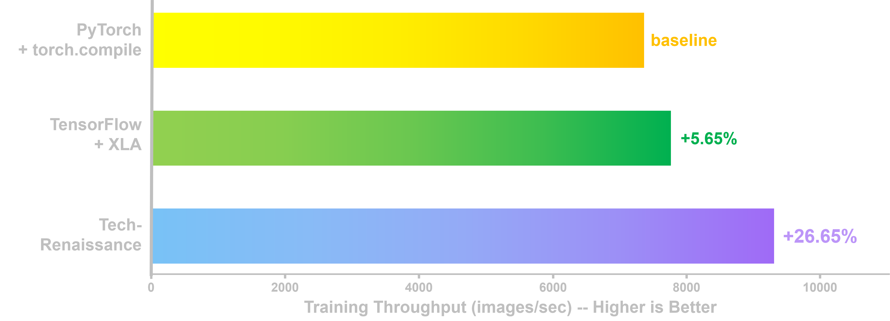
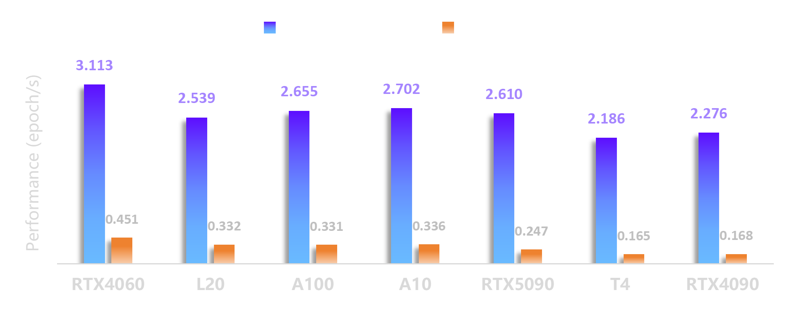

# Tech-Renaissance / 技术觉醒


> 单人团队以 AI 技术开发的超轻量级高性能深度学习训练框架

 


## 技术特点

- 静态图编译执行：通过 Compiler 将模型结构和训练任务编译为高度优化的计算图，大幅提升训练速度
- CUDA Graph 全捕获：对训练循环中的 H2D 传输、前向+反向融合、梯度通信、优化器更新等关键阶段进行 CUDA Graph 捕获，减少 CPU-GPU 调度延迟，稳定提升训练迭代吞吐效率
- FP16 AMP 混合精度训练：支持自动混合精度，FP32 权重与 FP16 计算共存，内置 Loss Scaling、NaN 检测与梯度裁剪，兼顾速度与精度
- 分布式数据并行：独创功能强大的分布式张量类，基于 NCCL 的梯度 AllReduce，支持分桶梯度聚合，轻松利用单机多卡平台实现高性能计算
- NHWC 张量布局：统一采用 NHWC 内存布局，首地址 256 字节对齐，适配 CUDA/cuDNN 性能最优模式
- 模块化架构：7 个独立模块（Core、Data、Tensor、Graph、Algo、Task、Backend），清晰分离基础设施、数据处理、图编译、算法配置与执行后端
- 生命周期管理与显存规划：预规划 Tensor 生命周期，科学分区设计，支持高效批量操作，消除动态分配时间开销和内存碎片
- 灵活的数据预处理：支持 ImageNet、CIFAR、MNIST 等数据集，内置 RandomResizedCrop、ColorJitter、Normalize 等增强操作
- 极致算子融合：Conv + BN + ReLU、数据增强、优化器、NCCL 通信等多个关键路径实现深度算子融合，另有独创的FusedNormalization多合一融合归一化算子，减少算子边界开销，节省显存带宽
- 高效流水线与双缓冲：数据加载、异步传输均采用双缓冲设计，数据管线实现高效流水线运作
- 异步传输与计算通信重叠：使用专门的非阻塞流，配合锁页内存、异步传输和 NCCL，实现高效的计算通信重叠，计算通信两不误，消除数据饥饿，压榨 GPU 性能利用率
- 多流架构：具备三计算流+传输流+更新流，高效实现并行化、流水化，借助新架构的NVIDIA GPU的高效调度能力，实测性能上明显领先于传统双流架构的深度学习框架
- 随机可复现性：严格设计的架构与算法实现，符合可复现要求，在不调用非确定性算子的情形下，同一程序在同一平台上多次运行可得到字节级一致的结果
- 超高线程并发：多线程预处理，即使开启超过200个线程依然完美并发，且不破坏随机可复现性
- 跨平台：支持 Windows 和 Linux 系统，支持 Turing 及以后的架构（常用的 GPU 包括 A100、A10、L20、T4、RTX5090等均已通过测试）
- 极简API：科学设计顶层API，写法优雅、功能强大，34 行代码完整训练 MLP 至 99.4% 以上的 MNIST 准确率，新手无痛入坑，老手省心炼丹


## 性能测试

### VGG16BN 训练吞吐量方面与 PyTorch、TensorFlow 的对比

在 A100 × 8 的 GPU 云服务器平台上，分别用 Tech-Renaissance、PyTorch（2.9.0）、TensorFlow（2.15.1）进行 VGG16BN 的 ImageNet 训练。结果显示，即使面对写法高度优化的 PyTorch 和 TensorFlow 训练脚本，Tech-Renaissance 依然表现出明显的吞吐量优势，且训练的准确率结果完全符合 VGG16BN 的预期水准（TOP-1 73.80% | TOP-5 91.71%）。



| 框架 | 吞吐量 (Images/sec) | 每 Epoch 用时 (s) | 加速比 (vs PyTorch) |
| :--: | :--------: | :--------: | :--------: |
| PyTorch + torch.compile | 7,351.20 | 174.280 | baseline |
| TensorFlow + XLA | 7,766.34 | 164.964 | +5.65% faster |
| **Tech-Renaissance** | **9,310.13** | **137.610** | **+26.65% faster** |

（注：对比为严格公平对比，三者在同一机器运行测试，使用完全相同的超参数、模型结构、训练算法和预处理线程数，且均开启 AMP，PyTorch 开启 torch.compile、TensorFlow 开启 XLA，且均排除编译用时。详见[测试样例](tests/example)）


### MLP 训练速度与 PyTorch 的多平台对比

简单任务高效利用算力资源也是一大挑战。在七个不同的GPU测试平台，Tech-Renaissance 均表现出极大的性能优势。



（注：对比为严格公平对比，双方在同一机器运行测试，使用完全相同的超参数、模型结构、训练算法和预处理线程数，且均开启 AMP，PyTorch 开启 torch.compile 且排除编译用时。详见[测试样例](tests/example)）


## 基本依赖

|    工具/库     |  最低版本   |
| :------------: | :---------: |
|     CMake      |    3.28     |
|      gcc       |    13.3     |
|      MSVC      | 14.44.35207 |
|     Ninja      |    1.11     |
|     Python     |    3.12     |
|     Eigen      |     5.0     |
|    XNNPACK     | 2024-08-20  |
|      CUDA      |    13.1     |
|     cuDNN      |    9.17     |
| cuDNN Frontend |    1.17     |
|      NCCL      |    2.29     |
|      zlib      |     1.3     |
|    libcurl     |     8.5     |
| libjpeg-turbo  |     3.1     |
|    mimalloc    |     3.2     |
|      stb       | 2024-07-29  |
|      simd      |     6.2     |


## 快速开始

本项目推荐以 Docker 容器的方式运行。

```bash
# 克隆项目
mkdir -p /opt/tr4 && cd /opt/tr4
git clone https://gitee.com/tech-renaissance/renaissance.git

# 启动容器
docker pull crpi-vbtd6yj00u83ugqk.cn-beijing.personal.cr.aliyuncs.com/tech-renaissance/tr4:v4.20
docker run -d -it --name tr4-dev --gpus all --cap-add SYS_NICE -v /opt/tr4:/opt/tr4 -w /opt/tr4 \
    crpi-vbtd6yj00u83ugqk.cn-beijing.personal.cr.aliyuncs.com/tech-renaissance/tr4:v4.20 \
    tail -f /dev/null
docker exec -it tr4-dev bash

# 配置编译
cd /opt/tr4/renaissance && python configure.py
./build.sh

# 运行示例
/opt/tr4/renaissance/build/bin/tests/example/mlp_mnist
```


## 文件结构

| 模块 | 源码 | 公开头文件 | 职责 |
|------|------|-----------|------|
| Core | `src/core/` | `include/renaissance/core/` | 类型系统、日志、RNG、全局配置、异常 |
| Data | `src/data/` | `include/renaissance/data/` | 数据加载、图像预处理增强管线 |
| Tensor | `src/tensor/` | `include/renaissance/tensor/` | CPU 端 Tensor 与分布式 DTensor |
| Graph | `src/graph/` | `include/renaissance/graph/` | 计算图构建、编译、内存规划、CUDA Graph 捕获 |
| Algo | `src/algo/` | `include/renaissance/algo/` | 损失函数、优化器、学习率调度器 |
| Task | `src/task/` | `include/renaissance/task/` | 训练/推理任务门面与生命周期 |
| Backend | `src/backend/` | `include/renaissance/backend/` | 算子注册、设备上下文、图执行器、内存池 |


## 团队组成

核心设计人员（按贡献程度排序）：ChatGPT 5、GLM 4.6、Gemini 3、Kimi K2.6、Sonnet 4.6、Opus 4.6

核心开发人员（按贡献程度排序）：Sonnet 4.6、DeepSeek V4 Pro、Kimi K2.6

其他人员：一个人类


## 开源协议

本项目采用 [Apache License 2.0](LICENSE)。
